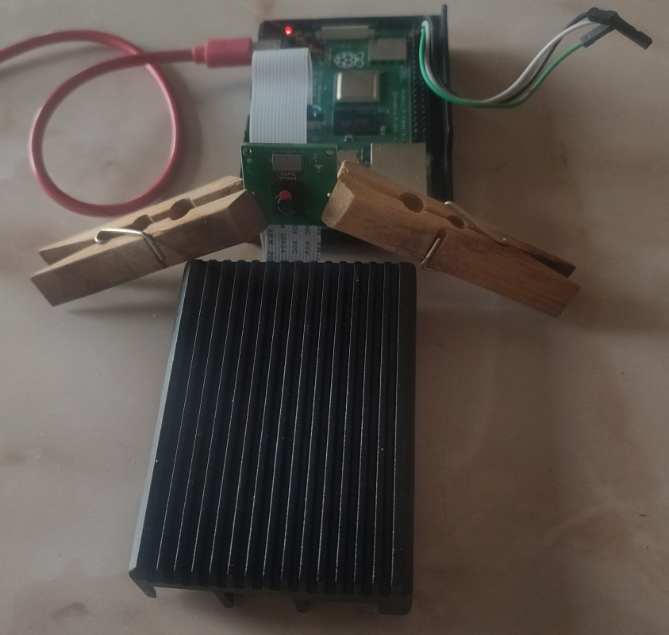

A [NixOS](https://nixos.org) module to stream video from Raspberry Pi 4 model B. The project is in a
draft state and will probably remain there permanently. Only one particular set of hardware is
supported, see the [Hardware](#hardware) section. A number of problems has been revealed in the
course of the development. For some of them the workarounds were found and described in the
[Problems](#problems) section. Have fun!

Contents
--------

<!-- vim-markdown-toc GFM -->

* [Hardware](#hardware)
* [Software](#software)
* [Setting up](#setting-up)
* [Usage notes](#usage-notes)
    * [Detecting the camera](#detecting-the-camera)
    * [Making a snapshot](#making-a-snapshot)
    * [Video streaming using the rpicam-apps TCP mode (works)](#video-streaming-using-the-rpicam-apps-tcp-mode-works)
    * [Video streaming via the Gstreamer module shipped with libcamera (does not work)](#video-streaming-via-the-gstreamer-module-shipped-with-libcamera-does-not-work)
* [Problems](#problems)
    * [Where to find device tree overlay sources for the camera?](#where-to-find-device-tree-overlay-sources-for-the-camera)
    * [Meson buildsystem does not detect boost on NixOS](#meson-buildsystem-does-not-detect-boost-on-nixos)
    * [libcamera Gstreamer plugin reports timeout](#libcamera-gstreamer-plugin-reports-timeout)

<!-- vim-markdown-toc -->

Hardware
--------

* [Raspberry Pi 4 model B](https://www.raspberrypi.com/products/raspberry-pi-4-model-b/)
* [Arducam camera sensor ov5647](https://docs.arducam.com/Raspberry-Pi-Camera/Native-camera/5MP-OV5647/)



Software
--------

In this setup, the Raspberry board runs NixOS, initially the cross-compiled [installation
image](https://github.com/sergei-mironov/nixos-raspi-installer), later replaced by natively
switching the system to a main configuraiton. The `raspi-camera.nix` module from this repo is
supposed to be a part of such a configuraiton.

Setting up
----------

Template flake.nix

``` nix
{
  inputs = rec {
    raspi-camera = {
      url = "github:sergei-mironov/nixos-raspi-camera";
      inputs.nixpkgs.follows = "nixpkgs";
    };

    ...
  };
  outputs = { self, ... , raspi-camera } : {
    nixosConfigurations = {
      raspi = nixpkgs.lib.nixosSystem rec {
        system = "aarch64-linux";
        modules = [
          ...
          raspi-camera.nixosModules.raspi-camera
          ...
        ];
      };
    };
  }
}
```

Usage notes
-----------

### Detecting the camera

``` sh
$ cam -l
[0:01:07.881818018] [957]  INFO Camera camera_manager.cpp:316 libcamera v0.3.1
[0:01:07.988647665] [962]  INFO RPI vc4.cpp:447 Registered camera /base/soc/i2c0mux/i2c@1/ov5647@36 to Unicam device /dev/media4 and ISP device /dev/media0
Available cameras:
1: 'ov5647' (/base/soc/i2c0mux/i2c@1/ov5647@36)
```

### Making a snapshot

TODO

### Video streaming using the rpicam-apps TCP mode (works)

https://www.raspberrypi.com/documentation/computers/camera_software.html#tcp

Raspberry PI:

``` shell
$ rpicam-vid -t 0 --inline --listen -o tcp://0.0.0.0:5000
```

Client:

``` shell
$ vlc tcp/h264://10.0.0.80:5000
```

Downsides:

* Only one connection at a time
* Server crashes on disconnect

### Video streaming via the Gstreamer module shipped with libcamera (does not work)

https://github.com/raspberrypi/libcamera


Raspi:

```sh
export LIBCAMERA_LOG_LEVELS=*:DEBUG

export GST_PLUGIN_SYSTEM_PATH_1_0=/nix/store/wlrmb5096gyi5xswy79kn6lpaj2b8p19-gstreamer-1.24.3/lib/gstreamer-1.0/

sudo gst-launch-1.0 libcamerasrc ! \
     video/x-raw,colorimetry=bt709,format=NV12,width=1280,height=720,framerate=30/1 ! \
     queue ! jpegenc ! multipartmux ! \
     tcpserversink host=0.0.0.0 port=5000
```

Client:

TODO

Problems
--------

### Where to find device tree overlay sources for the camera?

In contrast to [NixOS best
practices](https://wiki.nixos.org/wiki/NixOS_on_ARM/Raspberry_Pi#Device_trees), this repo includes a
[binary device tree overlay](https://github.com/raspberrypi/firmware/blob/master/boot/overlays/ov5647.dtbo)
from the Raspberry Pi firmware repo. Where can one find the sources of this overlay?

### Meson buildsystem does not detect boost on NixOS

A workaround in [raspi-camera.nix](./nix/raspi-camera.nix)

``` nix
env = {
  BOOST_INCLUDEDIR = "${lib.getDev boost}/include";
  BOOST_LIBRARYDIR = "${lib.getLib boost}/lib";
  # Also required in addition to the above fix.
  NIX_CFLAGS_COMPILE = "-I${lib.getDev boost}/include -L${lib.getDev boost}/lib";
};
```

Related reports:

* [Meson no longer able to pick up Boost](https://github.com/NixOS/nixpkgs/issues/86131#issuecomment-620155616)

### libcamera Gstreamer plugin reports timeout

Libcamera docs describe a
[neat way to run the streaming using Gstreamer](https://github.com/raspberrypi/libcamera?tab=readme-ov-file#using-gstreamer-plugin)
alone.

Sadly, we see the TIMEOUT failures, similar to what is described [in this raspi forum
thread](https://forums.raspberrypi.com/viewtopic.php?t=323609). Unfortunately, removing `arm64bit=1`
from the `/boot/config.txt` is not an option because NixOS only supports 64bit.

The workaround was to [switch](#video-streaming-using-the-rpicam-apps-tcp-mode-works) to
`rpicam-apps`.


